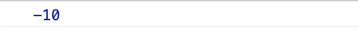

Type conversion and coersion is this.

> Type conversion : when we convert manually from one type to another.

> Type coersion : when JS converts types automatically.


Let's take a look with some examples.


## Type conversion to number

```js
const inputYear = '1991';
console.log(typeof inputYear);
// this is string.

console.log(typeof Number(inputYear));
// now it's number.

```

Result:


⚠︎Remember that you need to start with a **capital letter**! (i.e. Number)


## Type conversion to String

```js
const inputYear = 1991;
console.log(typeof inputYear);
// this is number.

console.log(typeof String(inputYear));
// now it's string.


```

Result:


⚠︎Remember that you need to start with a **capital letter**! (i.e. Number)


### Type Coersion 

JavaScript convert types automatically in some situation. This it the example.

```js
// type coersion
console.log('I am ' + 23 + " year's old")
```

Result:


Even though I didn't convert the data type of `23` from number to strings, it's converted itself and concatenate the strings; `I am`, `23`, and `year's old`.  

It's because the  `plus operator(+)` triggers a coersion to strings here. 

Whenever there's a plus operator between a string and a number, the number will be converted .


**But with a minus operator`(-)`, it's opposite. **

The `minus operator(-)` triggers a coersion to a <u>number.</u>


Okay, let's see the example.

```js
// when you use minus operator
console.log('10'-10-'10');
```

Result: 



It's converted to **numbers**!

but, if you use a plus operator,

```js
// when you use plus operator
console.log('10'+10+'10');
```

Result:


WHATTTTT


I know right? So interesting.

It's because we use `+` to concatenate strings.

**Only `+` converts the data type to strings.**


| operator | coersion   |
| -------- | ---------- |
| +        | to strings |
| -        | to numbers |
| *        | to numbers |
| /        | to numbers |
| >        | to numbers |


