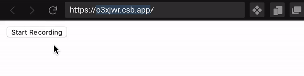

유투브 클론 + 녹음기 만들기 + 카운트 다운


### 1. 유튜브 클론 강의 수강


### 2. 녹음기 과제제출





오늘 과제는 간단하게 녹음기를 만드는 것이었다.

다음부터는 사용했을때 어떻게 움직일지를 생각을 해놓고 해야겠다. 버튼을 여러개를 쓸 지, 아니면 한 버튼을 가지고 만들지, 리셋 버튼을 만들지 말지 미리 생각을 해놓지 않고 그냥 마구잡이로 만들었더니 시간이 너무 오래걸렸다.

카운트 다운은 자주 쓸 것 같다. 손에 익도록 자주 써봐야겠다.

`setInterval`을 쓰면 된다.

```js
const startBtn = document.getElementById("startBtn");

let timeleft = 5;
const downloadTimer = setInterval(function(){
timeleft--;
startBtn.innerText= `Recording....${timeleft}`;
  if(timeleft <= 0) clearInterval(downloadTimer);
},1000);
```


